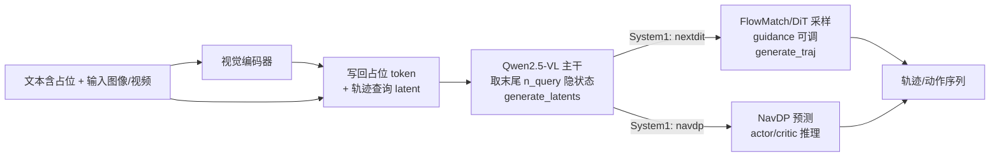

# InternVLA-N1 目录说明

该目录包含 InternVLA-N1 多模态导航/轨迹模型的核心实现与子模块。

## 模块总览

- **internvla_n1.py**
  - 基于 Qwen2.5-VL 的多模态因果语言模型封装（`InternVLAN1ForCausalLM`）。
  - 对齐文本、图像/视频与轨迹占位 token，计算 RoPE 位置并输出 logits。
  - 提供 System1 的两条分支损失计算，以及推理接口 `generate_latents`、`generate_traj`。

- **internvla_n1_policy.py**
  - 面向推理/交互的策略封装（`InternVLAN1Net`）。
  - 加载预训练权重，构造 tokenizer/processor，管理对话与历史帧。
  - 提供 `step` / `s2_step` 等接口完成图像预处理、prompt 构造与动作解析。

- **internvla_n1_arch.py**
  - 组装子模块与基础组件：导航分支 `navdp`、轨迹扩散 DiT、深度编码器等。
  - 定义常用编码模块：正弦位置编码、`MemoryEncoder`、`QFormer` 等。
  - 返回噪声调度器、视觉编码器等供主模型构建。

- **navdp.py**
  - 导航扩散策略 `NavDP_Policy_DPT_CriticSum_DAT`，包含 RGBD 编码、Transformer 解码与 actor/critic 头。
  - 使用 `DDPMScheduler` 与正弦时间嵌入进行序列动作预测。

- **nextdit_traj.py**
  - Lumina/NextDiT 轨迹扩散模型实现与配置，含自注意力/交叉注意力块。
  - 提供 2D 轨迹生成/去噪的核心 Transformer（`LuminaNextDiT2DModel`）。

- **nextdit_crossattn_traj.py**
  - 基于 `LuminaNextDiT2DModel` 的交叉注意力封装（`NextDiTCrossAttn`）。
  - 定义 `NextDiTCrossAttnConfig`，设置输入大小、通道、层数、注意力头数等超参。

## 数据流与分支逻辑

1. 文本中插入 IMAGE/VIDEO/TRAJ 占位 token，视觉特征写回后与可训练轨迹查询拼接。
2. Qwen2.5-VL 主干前向得到隐藏状态，按 System1 类型分支：
   - **nextdit**：扩散式轨迹预测，DiT 预测噪声，MSE 损失。
   - **navdp**：导航扩散分支，处理 RGBD/pointgoal，输出 actor/critic 头。
3. 推理阶段先用 `generate_latents` 得到轨迹 latent，再用 `generate_traj` 生成多步轨迹。

## 训练/推理架构图

> 图中仅展示主干与 System1 分支的核心数据流，细节实现见各子模块。

### 训练（概要）
```mermaid
flowchart LR
  A[文本含 IMAGE/VIDEO/TRAJ 占位] --> B[视觉编码器
  (image/video -> patch feats)]
  B --> C[写回占位 token
  与轨迹查询 latent 拼接]
  A --> C
  C --> D[Qwen2.5-VL 主干
  得到隐藏状态]
  D -->|System1: nextdit| E[DiT 轨迹扩散
  预测噪声]
  D -->|System1: navdp| F[NavDP RGBD/pointgoal
  扩散 + actor/critic]
  E --> G[MSE / mask loss]
  F --> G
  G --> H[反向传播/更新]
```

### 推理（概要）


## 依赖

- Transformers（Qwen2.5-VL）、Diffusers（FlowMatch/DiT）、PIL。
- 推理时可选：`flash_attention_2`。
- 内部编码器：Depth Anything V2、`DAT_RGBD_Patch_Backbone` 等（由 internnav 其他模块提供）。
